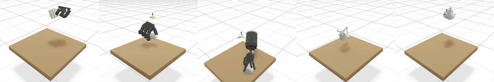
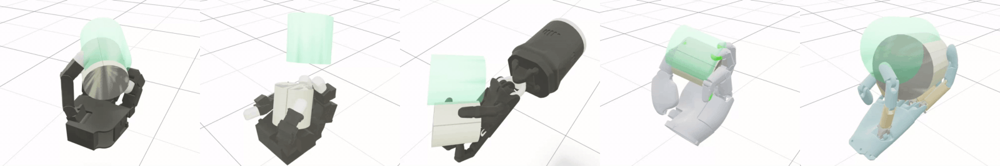

# mjlab dexhand

Dexterous manipulation tasks based on [mjlab](https://github.com/mujocolab/mjlab), providing grasping and in-hand rotation tasks for `Allegro`, `LEAP`, `Shadow`, `Sharpa`, and `Wuji`. It also includes the implementation of [ContactExplorer](https://arxiv.org/abs/2603.10971), which comprises:

- **Post-contact coverage reward**: rewards novel contacts between hand keypoints and object surface regions.
- **Pre-contact reaching reward**: guides hand keypoints toward under-explored object regions before contact.

## Tasks

<table>
  <tr>
    <th align="center"><code>Grasp-{Hand}</code></th>
  </tr>
  <tr>
    <td align="center"></td>
  </tr>
  <tr>
    <th align="center"><code>InHand-Rotation-{Hand}</code></th>
  </tr>
  <tr>
    <td align="center"></td>
  </tr>
</table>

`{Hand}` can be one of `Shadow`, `Allegro`, `LEAP`, `Sharpa`, or `Wuji`.

## Installation

```bash
git clone --recursive https://github.com/ruoyiqiao/mjlab_hand.git
cd mjlab_hand

# Install dependencies (Python ≥3.13 required)
uv sync
```

## Quick Start

Train grasping or in-hand rotation using Allegro Hand:

```bash
uv run train Grasp-Allegro --env.scene.num-envs 2048 --agent.max-iterations 10000
uv run train InHand-Rotation-Allegro --env.scene.num-envs 2048 --agent.max-iterations 10000
```

Useful flags: `--agent.seed`, `--env.scene.num-envs`, `--agent.max-iterations`, and `--env.rewards.contact_explorer_reward.weight 0.0` to disable ContactExplorer rewards.

## Custom Objects

Override the default object and scale:

```bash
# Train Allegro Hand to grasp a hammer
uv run train-object Grasp-Allegro --object hammer --env.scene.num-envs 2048

# Train Allegro Hand for in-hand rotation with a scaled cylinder
uv run train-object InHand-Rotation-Allegro --object cylinder_medium --scale 0.8,0.8,0.8
```

Objects are loaded from ContactDB. Examples: `cube`, `cylinder_medium`, `ps_controller`, `mug`, `flashlight`, `pan`.

> [!NOTE]
> Not every object in this repository has been tested. Some objects may need additional tuning on mdp components and training hyperparameters, to learn successfully.

## Evaluation & Playback

### Interactive Visualization

```bash
uv run play-object Grasp-Shadow --checkpoint-file /path/to/model.pt
```

### Batch Evaluation

```bash
uv run eval-policy --task Grasp-Allegro --checkpoint /path/to/model.pt --output eval_metrics.json
```

Prints success rate (grasp) or average successes before drop (rotation), and writes JSON when `--output` is provided.

**WandB integration:**

```bash
uv run eval-policy --task InHand-Rotation-Allegro --wandb-run-path entity/project/run_id
```


## Acknowledgements

* This project builds on robot MJCF/XML assets from [MuJoCo Menagerie](https://github.com/google-deepmind/mujoco_menagerie), [sharpa-robotics](https://github.com/sharpa-robotics/sharpa-urdf-usd-xml), and [wuji-technology](https://github.com/wuji-technology/wuji-description).
* Object meshes are sourced from [ContactDB](https://contactdb.cc.gatech.edu/).

## Citation

If you find this project useful, please consider citing it:

```bibtex
@article{liu2026contactexplorer,
  title={Contact Coverage-Guided Exploration for General-Purpose Dexterous Manipulation},
  author={Liu, Zixuan and Qiao, Ruoyi and Tie, Chenrui and Liu, Xuanwei and Lou, Yunfan and Gao, Chongkai and Xu, Zhixuan and Shao, Lin},
  journal={arXiv preprint arXiv:2603.10971},
  year={2026}
}

@article{zakka2026mjlab,
  title={mjlab: A Lightweight Framework for GPU-Accelerated Robot Learning},
  author={Zakka, Kevin and Liao, Qiayuan and Yi, Brent and Lay, Louis Le and Sreenath, Koushil and Abbeel, Pieter},
  journal={arXiv preprint arXiv:2601.22074},
  year={2026}
}
```
