# Experiment log book

> **How to update this log book.** When the user says "update the log books", do this for every
> experiment that produced results in the session: a final or reporting training run, a new idea
> being tried, or a comparison of conditions. Do it in the same turn and without asking. (1) Add
> an entry at the **top** of [Entries](#entries), because entries are listed newest first. Number it
> one higher than the current highest `E<N>` (never renumber), date it `YYYY-MM-DD` (the date the
> results came in), and start it with `<a id="eN"></a>` and the heading
> `### EN — YYYY-MM-DD — <title>`. If an experiment is still running, add the entry with
> **Status: running** and fill it in later, then change the date in the TOC row to the
> results date. (2) Fill in every field of the [entry template](#entry-template):
> question/hypothesis; status; **data** (stores and sizes, linked to [COLLECTIONS.md](COLLECTIONS.md));
> **policy inputs/outputs** (obs layout and width, horizons, action chunk and width, normalizer);
> training and eval protocol; results as tables **and embedded plots**; takeaways; and links to the
> [RUNS.md](RUNS.md) job IDs, to the [agent log book](agent_log_book.md) entry `A<N>` that holds the
> lower-level implementation changes, and to [CHANGES.md](CHANGES.md) items. (3) Save every figure
> into `docs/plots/` under a descriptive name, with its summary CSV next to it when one exists, and
> embed it as ``. Do not link to `outputs/` or `$SCRATCH`, because those
> are gitignored or purged. (4) Add a row at the top of the [Table of contents](#table-of-contents):
> number, date, and a **single-sentence** statement of the finding (the result, not just the topic).
> (5) If a later result overturns or qualifies an older entry, keep the old entry. Add a dated
> `> **Update YYYY-MM-DD:**` note to it that points to the new entry. Report only verified numbers
> and give the eval protocol (episodes, seeds, checkpoint rule) for every number. The agent log
> book's own update steps also apply. Entries E1–E6 were rebuilt on 2026-10-04 from the old
> `ANALYSIS.md` ([archive](archive/ANALYSIS_2026-08-26_to_2026-09-28.md), with full tables and
> derivations), and E7–E16 from the old journal. Their figures from the old cluster (E1–E6) were
> never copied to Vista, so those entries have tables only.

**Metrics.** Grasp is scored by **success rate**. InHand-Rotation is scored by **average successes
before drop**: the number of goal orientations reached before the object falls, higher is better, and
the RL expert reaches roughly 2–8. "σ" (sigma) is the ambient gate: the other hands' data trains only
diffusion timesteps t ≥ σ (out of 100). σ=0 is full co-training and σ=100 is target-only.

---

## Table of contents

| # | Date | Finding |
|---|---|---|
| [E21](#e21) | 2026-10-08 | Fine-tuning from full co-training (σ 0) beats fine-tuning from the best ambient runs (σ 15): 1.17 vs 0.90 successes before drop at held-out seed 4321 (target-only start: 0.71). Ambient gating gives the best policy *before* fine-tuning (0.86) but gains almost nothing from it. The σ curve replicates at seed 4321. |
| [E20](#e20) | 2026-10-07 | Per target and metric, co-train-then-fine-tune is best (mean 1.23 successes before drop vs 0.75 pooled ambient, 0.63 target-only, 0.42 full co-training; 3 seeds); full co-training is worst for 4 of 5 hands. |
| [E19](#e19) | 2026-10-07 | With 3 seeds, rotation ambient gating peaks on a plateau at σ 9–20 (mean 0.80–0.85 vs 0.63 target-only, 0.42 co-training, consistent across seeds); the best σ is hand-specific (Allegro/LEAP/Shadow 2–6, Sharpa/Wuji ≥ 9–15), and σ 15 is the only setting at or above target-only for every hand. |
| [E18](#e18) | 2026-10-06 | Rotation ambient σ sweep (random-draw 50k targets): σ 10–20 is best (mean 0.85 successes before drop vs 0.64 target-only and 0.43 full co-training), and above σ≈30 it is flat at the target-only level. |
| [E17](#e17) | 2026-10-04 | The demos were collected at env seed 0, so seed-0 evals replay training starts. Target-only 50k grasp policies memorize (0.92–0.95 on training starts vs 0.32–0.39 on new ones), while co-trained and fine-tuned policies generalize. |
| [E16](#e16) | 2026-10-04 | Fine-tuning at lr 1e-4 forgets every non-target hand (0.00). lr 1e-5 keeps most of grasp (0.82) but not rotation (0.25). Co-trained grasp generalists score 0.94–1.00 on the four hands they saw at 1M. |
| [E15](#e15) | 2026-10-04 | Co-training on all 5 hands and then fine-tuning on the 50k target beats both co-training and target-only training: grasp 0.91 vs 0.76/0.38, rotation 1.34 vs 0.66/0.70. |
| [E14](#e14) | 2026-10-03 | With term-aligned padding, co-training gives a large grasp gain (+0.38..+0.44) and a small rotation loss (−0.04..−0.15) against target-only 50k. |
| [E13](#e13) | 2026-10-01 | Tail-padded ambient rotation sweep: co-training works only for Allegro/LEAP, whose columns line up, so the layout is the problem. |
| [E12](#e12) | 2026-10-01 | Ambient minmax, Allegro target: the target improves with σ, and the gated LEAP control drops to 0.00 already at σ=10. |
| [E11](#e11) | 2026-09-30 | Pooled runs scored 0 because of the padded path's Gaussian normalizer and clamp. A min/max padded run matches plain training. |
| [E10](#e10) | 2026-09-28 | Vista GH200 throughput per node is flat from 4 to 16 packed runs, and multi-node jobs scale linearly. |
| [E9](#e9) | 2026-09-27 | Single-hand specialist baselines: grasp at 1M is about 1.0 for all hands; the rotation specialists trained, but their scores were never tabulated. |
| [E8](#e8) | 2026-09-13 | At batch 256 one network saturates an A40, so vmap and bf16 give nothing. `torch.compile` gives 1.34× on training and 2.0× on sampling. |
| [E7](#e7) | 2026-09-02 | Rotation BC at 400k reaches 2.31 (LEAP) and 1.62 (Allegro) successes before drop. |
| [E6](#e6) | 2026-08-31 | A shared embodiment-invariant state encoder is ruled out: a fresh probe still identifies the hand at ≥0.977 balanced accuracy. |
| [E5](#e5) | 2026-08-27 | The observation identifies the embodiment perfectly (AUC 1.000) at every timestep, and normalization does not remove it. |
| [E4](#e4) | 2026-08-27 | Ambient sweep (Allegro+LEAP grasp/rotation, data-first sampler): the interior σ is a valley, and the gated source drops to 0. |
| [E3](#e3) | 2026-08-27 | Premise check: the noised Allegro and LEAP action distributions converge only at t≈95, which moved the σ grid to {50,75,90}. |
| [E2](#e2) | 2026-08-26 | One-hot mixed-embodiment training (Allegro+LEAP) is roughly capacity-neutral, and the design was underpowered. |
| [E1](#e1) | 2026-08-26 | Only Allegro and LEAP share obs/action widths and term layout. The hands differ mostly by a rigid offset, and actions are stored pre-clip (±15). |

---

## Entry template

```md
<a id="eN"></a>
### EN — YYYY-MM-DD — <title>

**Question.** ...  **Status.** done | running | abandoned
**Data.** stores, sizes, target/source split (COLLECTIONS.md links)
**Policy inputs/outputs.** obs (layout, width, horizon) -> action chunk (horizon, width, executed prefix); normalizer
**Protocol.** training (epochs/steps, lr, seeds, sampler, gating) and eval (envs x steps, seed, checkpoint rule)
**Results.** table(s) + 
**Takeaways.** ...
**Links.** RUNS: `<job ids>` · Agent log: [AN](agent_log_book.md#aN) · CHANGES: items ...
```

---

## Entries

<a id="e21"></a>
### E21 — 2026-10-08 — Fine-tuning from ambient-gated runs

**Question.** Does starting the target-only fine-tune from the best ambient run (σ 15) beat starting from full
co-training (σ 0, the E15 recipe) or from target-only training (σ 100, i.e. 10 more target epochs)? Does the gain hold
on start states not used to choose σ or checkpoints, and how much do the other hands forget?
**Status.** done (2026-10-09 00:18): every fine-tune scored on its own hand at seeds 4321 and 1234
(best_rollout, best_val, last0) and on the four other hands at 4321 (best_val, last0); sources on the other hands at
4321 (best_val).

**Data.** Target 50k random draw (`padded_ta/InHand-Rotation_pad5_scarce<Hand>_K50kr.zarr`, [E18](#e18)); sources are
[E19](#e19)'s runs on the same stores.

**Policy inputs/outputs.** As [E14](#e14).

**Protocol.**
- Sources: E19 `ambient_ta_r/InHand-Rotation-<Hand>_sigma{0,15,100}_seed{0,1,2}/policy_best_val.pt`. σ 15 was chosen
  as the one σ at or above target-only for every hand in E19 (seed 1234), shared by all hands, instead of each hand's
  own best σ.
- Fine-tune: `--init-checkpoint` (weights + normalizer, fresh optimizer), target-only gating (`ambient-tmin` 0 for the
  target, 100 for the others), lr 1e-5, 10 epochs, eval every epoch (32 envs × 1500 steps, env seed = training seed),
  same seed as the source. 5 targets × 3 σ × 3 seeds = 45 runs (`ambient_ta_r_ft/`).
- Reporting: 100 envs × 1500 steps, first episode per env. **Test seed 4321** (new: not used for any selection) for
  the fine-tunes (best_rollout, best_val, last0) and for all 150 E19 runs (best_val), so the fine-tunes and their
  starting points are compared on the same held-out starts; seed 1234 too for the fine-tunes, to compare with E20.
  Forgetting: fine-tunes (best_val, last0) and their sources (best_val) on the four other hands at seed 4321
  (`cross_eval.jsonl`).

**Results (target hand, held-out seed 4321).** Successes before drop, 3-seed means; start = source best_val,
fine-tuned = `last0` (the reporting checkpoint, MIGRATION section 7):

| Target | σ 0: start → fine-tuned | σ 15: start → fine-tuned | σ 100: start → fine-tuned |
|---|---|---|---|
| Allegro | 0.80 → **1.45** | 1.21 → 1.18 | 0.86 → 1.00 |
| LEAP | 0.73 → **1.37** | 0.76 → 0.74 | 0.47 → 0.52 |
| Shadow | 0.20 → **0.85** | 0.60 → 0.66 | 0.35 → 0.55 |
| Sharpa | 0.28 → **0.92** | 0.69 → 0.83 | 0.66 → 0.74 |
| Wuji | 0.20 → **1.25** | 1.02 → 1.07 | 0.78 → 0.73 |
| **Mean** | 0.44 → **1.17** | 0.86 → 0.90 | 0.62 → 0.71 |

- Per training seed, fine-tuned mean over hands: σ0 1.19 / 1.14 / 1.17, σ15 0.94 / 0.89 / 0.86, σ100 0.63 / 0.71 / 0.79.
  σ 0 is best for every seed and every hand.
- Same ranking with the other fine-tune checkpoints (mean): best_val σ0 1.04 / σ15 0.90 / σ100 0.68; best_rollout
  1.17 / 0.87 / 0.70.
- Matches E15/E20 on the old `_K50k` subsets (fine-tuned from σ 0: 1.23-1.34 at seed 1234), now on random-draw data
  and a held-out seed.
- Starting policies at seed 4321, all 205 `ambient_ta_r` runs (best_val; mean over hands of 3-seed means): σ0 0.44,
  σ1-6 0.70-0.73, σ9 0.82, σ12 0.86, σ15 0.86, σ18 0.81, σ20 0.80, σ100 0.62 (seed 1234: 0.42, 0.68-0.69, 0.85, 0.82,
  0.84, 0.80, 0.80, 0.63). Choosing σ 15 on seed 1234 did not overfit those starts.

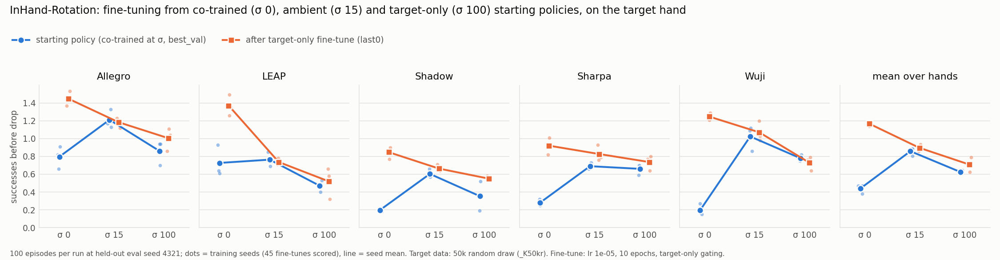

**Takeaways.**
- **For a fine-tuned target, start from full co-training, not from ambient gating.** Ambient gating (σ 15) is the
  best *non-fine-tuned* policy, but fine-tuning adds only +0.04 to it, against +0.73 from σ 0. Ten more target-only
  epochs from σ 100 add +0.09, so σ 0's gain is not just extra training.
- A reading, not tested: co-training at all noise levels makes the network learn the shared rotation skill at the
  low-noise end, where the target is weak, and fine-tuning then adapts it to the target. Gating the other hands to
  t ≥ 15 keeps the low-noise end target-only, so there is less to transfer.
- **Why σ 15 gains so little (sample count, from the sampler code; not an ablation).** The noise-first sampler draws
  t, then a window uniformly among the windows admitted at t, so each hand's share follows its size: the target is
  1.26% of the ~3.95M-window pool. Target share of training samples: σ 0 1.3% at every t (2.5M target draws over
  the 786k-step run); σ 15 100% at t < 15 and 1.3% above (32.4M); σ 100 100% (201M). The fine-tune (154k steps, all
  target) adds 39.5M: 15.5× what the σ 0 run had saw, 1.2× for σ 15, 0.2× for σ 100. The σ 15 run's low-noise steps
  were already trained on the target only (~650 passes over 50k), so the fine-tune mostly repeats them. σ 0 is
  pre-trained on 4M windows at every t and then adapted. Proposed tests: target-weighted co-training (25-50% of each
  batch), fine-tuning σ 15 at t ≥ 15 only, gating at σ 1-3 before fine-tuning.

**Results (seed 1234, own hand, last0; comparable with E20).** Mean start → fine-tuned: σ 0 0.42 → 1.16, σ 15
0.84 → 0.93, σ 100 0.63 → 0.69; per hand σ 0 fine-tuned is best for every hand (Allegro 1.45, LEAP 1.33, Shadow 0.73,
Sharpa 1.01, Wuji 1.29). Same picture as seed 4321.

**Results (forgetting: mean over the four other hands, seed 4321).**

| Target | σ 0: start → last0 (best_val) | σ 15: start → last0 | σ 100: start → last0 |
|---|---|---|---|
| Allegro | 1.26 → 0.06 (0.61) | 0.05 → 0.00 | 0.00 → 0.00 |
| LEAP | 1.30 → 0.29 (1.10) | 0.08 → 0.01 | 0.00 → 0.00 |
| Shadow | 1.48 → 0.17 (1.12) | 0.36 → 0.06 | 0.00 → 0.00 |
| Sharpa | 1.46 → 0.67 (0.98) | 0.07 → 0.05 | 0.00 → 0.00 |
| Wuji | 1.36 → 0.09 (0.52) | 0.09 → 0.00 | 0.00 → 0.00 |
| **Mean** | 1.37 → **0.26** (0.87) | 0.13 → 0.02 | 0.00 → 0.00 |

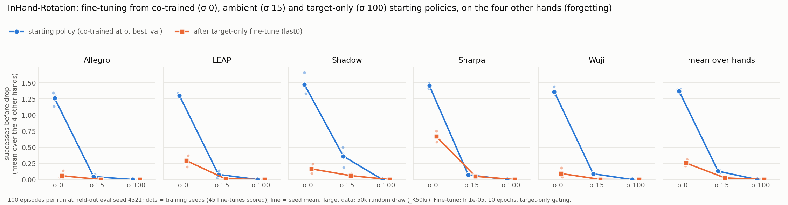

- Only the σ 0 policy is a generalist to start with (1.37 on the other hands, more than on its own 50k target).
  σ 15 sources already fail the other hands (0.13): a hand trained only at t ≥ 15 does not work, as in E12.
- 10 epochs of target-only fine-tuning at lr 1e-5 remove most of it (`last0` 0.26). The fine-tune's `best_val`
  checkpoint, picked at epochs 1-5 (σ 0 fine-tunes: 1,1,1,2,2,2,3,4,4,4,5,5,5,5,8), keeps 0.87 on the other hands
  with 1.04 on the target (vs 1.17 at last0): a shorter fine-tune is a target/generality trade-off point.
  E16 saw the same on the old subsets (rotation 0.25 at lr 1e-5).

**Links.** RUNS: E21 row, idev c639-092 row · Agent log: [A43](agent_log_book.md#a43), [A44](agent_log_book.md#a44)
· CHANGES: items 74-76

---

<a id="e20"></a>
### E20 — 2026-10-06 — Rotation regimes per target: co-training, ambient gating, target-only, fine-tuning

**Question.** Per target hand and per metric, how do the training regimes compare: full co-training (σ=0),
ambient gating (0<σ<100, pooled), target-only (σ=100), and co-training followed by fine-tuning?
**Status.** done (figures re-rendered 2026-10-07 with E19's runs).

**Data.** σ runs: [E18](#e18) (`_K50kr`, target 50k random draw + four hands at 1M), σ 0..100 step 10, seed 0.
Fine-tuned: [E15](#e15)'s rotation fine-tunes, which used the **older first-episodes** 50k subsets (`_K50k`)
and started from the co-trained σ0 runs on those subsets; lr 1e-4 and 1e-5 × 2 seeds per target.

**Policy inputs/outputs.** As [E14](#e14).

**Protocol.** Checkpoint `best_val` for every run, re-scored at 100 envs × 1500 steps, eval seed 1234.
Runs per target (updated 2026-10-07 with [E19](#e19)): σ0 3, 0<σ<100 35 (σ 1–20 × 3 seeds + σ 10, 30–90 × 1 seed),
σ100 3, fine-tuned 4. `scripts/plot_condition_boxes.py` (CHANGES 72).

**Results.** Mean over runs and targets (co-training σ0 / ambient 0<σ<100 / none σ100 / fine-tuned):

| Metric | co-training | ambient | none (target-only) | fine-tuned |
|---|---|---|---|---|
| successes before drop | 0.42 | 0.75 | 0.63 | **1.23** |
| episodes reaching ≥ 1 target | 0.31 | 0.53 | 0.47 | **0.74** |
| per-target success rate | 0.26 | 0.38 | 0.31 | **0.54** |
| survival time before drop (s) | 6.6 | 10.5 | 11.6 | **13.8** |
| final rotation distance (rad, lower better) | 0.83 | 0.62 | 0.60 | **0.54** |

Successes before drop, mean per target (co-training / ambient / none / fine-tuned): Allegro 0.71 / 1.16 / 0.86 / 1.74;
LEAP 0.71 / 0.69 / 0.42 / 1.28; Shadow 0.17 / 0.54 / 0.34 / 0.74; Sharpa 0.20 / 0.51 / 0.73 / 0.98;
Wuji 0.31 / 0.84 / 0.81 / 1.38. Fine-tuned by lr: 1e-4 1.26, 1e-5 1.20.

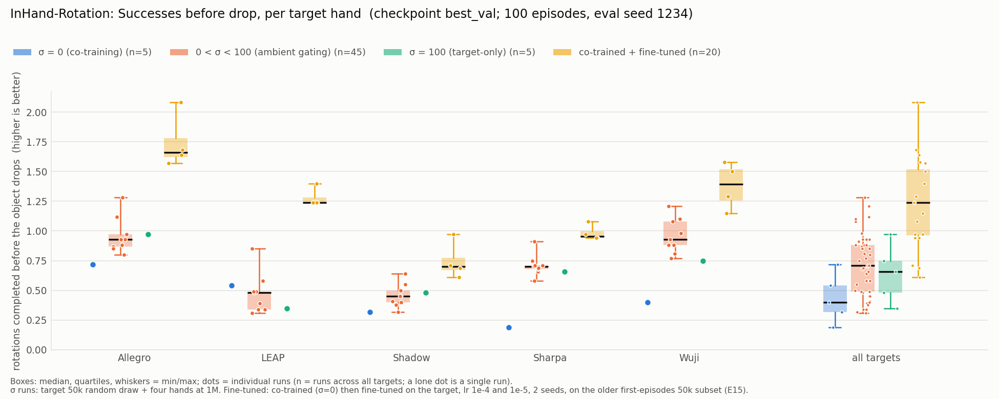
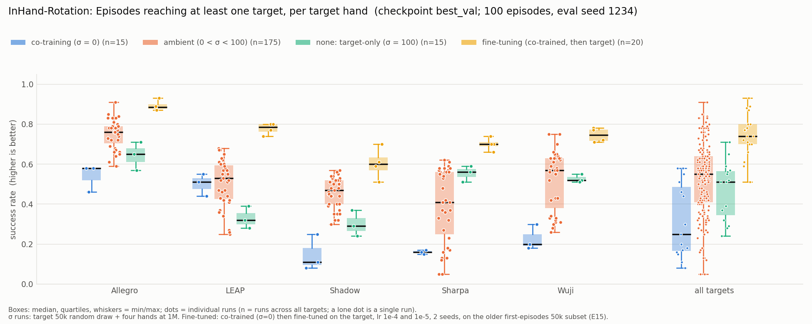
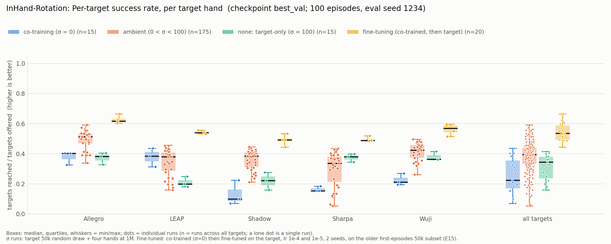
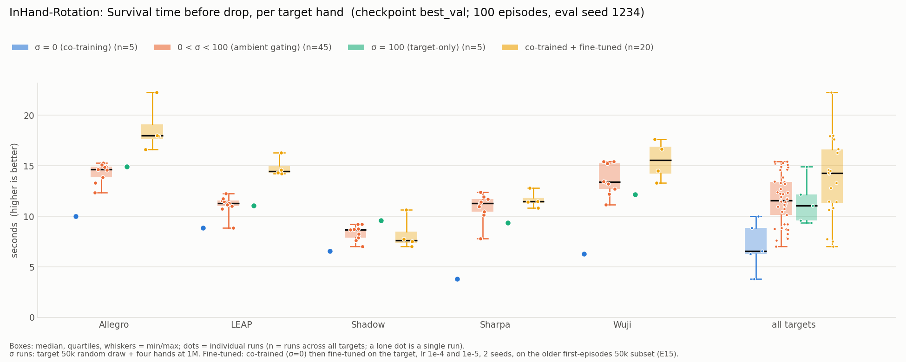
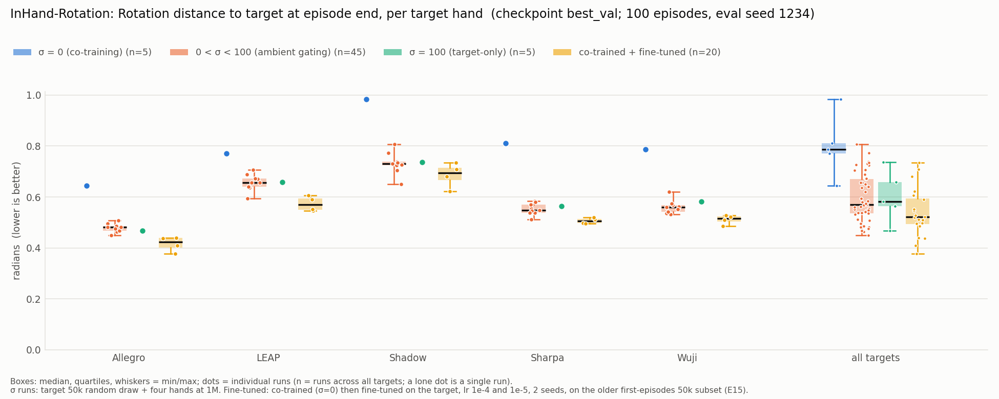
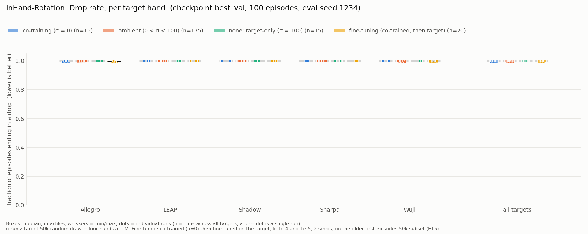

Raw values: [`plots/rotation_conditions_box_summary.csv`](plots/rotation_conditions_box_summary.csv).

**Takeaways.**
- **Fine-tuning has the highest mean for every target and every informative metric**, about 2× target-only on
  successes before drop (1.23 vs 0.63). Its survival time is also highest, while pooled ambient survives slightly
  less long than target-only (10.5 vs 11.6 s) because low σ hurts Sharpa and Wuji.
- **Pooled ambient is above target-only on successes** (0.75 vs 0.63), but the box hides the σ structure: σ 9–20 is
  much better than σ 1–6 ([E19](#e19)). Per hand, pooled ambient is below target-only for Sharpa (0.51 vs 0.73).
- **Full co-training is the worst regime for 4 of 5 targets**; LEAP is the exception (0.71 vs 0.42 target-only).
- Caveat: the fine-tuned box is on the older first-episodes subsets, the others on the random draw. On the old subsets
  σ0/σ100 scored higher (0.58/0.73, E18), so part of the fine-tuning margin could come from the data draw, though not
  most of it (1.23 vs 0.73). Fine-tunes from the E19 runs on `_K50kr` are being planned to remove this.

**Links.** RUNS: `1049683`, `1052839`, `1045839` · Agent log: [A41](agent_log_book.md#a41), [A42](agent_log_book.md#a42) · CHANGES 72.

<a id="e19"></a>
### E19 — 2026-10-07 — Ambient σ fine grid (1–20) × 3 seeds, rotation

**Question.** [E18](#e18) found the best σ at 10–20 on a step-10 grid with one seed. Where exactly is the
peak in σ 1–20, and how large is seed-to-seed variance?  **Status.** done.

**Data.** As [E18](#e18): `padded_ta/InHand-Rotation_pad5_scarce<Hand>_K50kr.zarr` (target 50k random draw, draw
seed 0, + the other four hands at 1M). Every training seed uses the same draw.

**Policy inputs/outputs.** As [E14](#e14)/[E18](#e18).

**Protocol.** σ ∈ {1, 2, 3, 6, 9, 12, 15, 18, 20} × 5 targets × training seeds {0, 1, 2}, plus σ 0 and 100 × seeds
{1, 2}; σ 0/20/100 seed 0 reused from E18, so 150 new runs and 3 seeds at σ 0, 1–20 (except 10) and 100 (σ 10 and
30–90 stay single-seed from E18). Recipe identical to E18 except σ and seed. Job `1052839`: 2 runs per node, 15 × 5
nodes, 8h32–9h03 per job. Reporting: `best_val`, re-scored at 100 envs × 1500 steps, eval seed 1234 (only each env's
first episode is scored; the same 100 start states for every run of a hand).

**Results.** Successes before drop, mean of 3 training seeds:

| σ | 0 | 1 | 2 | 3 | 6 | 9 | 12 | 15 | 18 | 20 | 100 |
|---|---|---|---|---|---|---|---|---|---|---|---|
| Allegro | 0.71 | 1.18 | 1.19 | 1.31 | **1.33** | 1.30 | 1.21 | 1.24 | 1.20 | 1.09 | 0.86 |
| LEAP | 0.71 | 0.84 | 0.86 | **0.89** | 0.78 | 0.86 | 0.79 | 0.65 | 0.57 | 0.54 | 0.42 |
| Shadow | 0.17 | 0.52 | **0.62** | 0.43 | 0.60 | 0.60 | 0.61 | **0.62** | 0.56 | 0.55 | 0.34 |
| Sharpa | 0.20 | 0.38 | 0.17 | 0.16 | 0.14 | 0.46 | 0.49 | 0.73 | **0.74** | 0.71 | 0.73 |
| Wuji | 0.31 | 0.55 | 0.62 | 0.60 | 0.57 | 1.04 | 1.00 | 0.95 | 0.92 | **1.09** | 0.81 |
| **mean** | 0.42 | 0.69 | 0.69 | 0.68 | 0.68 | **0.85** | 0.82 | 0.84 | 0.80 | 0.80 | 0.63 |

Mean over hands minus σ 100, per training seed (0 / 1 / 2): σ 0 −0.21 / −0.30 / −0.13; σ 1–6 +0.00 to +0.11
(mean +0.05); σ 9 +0.20 / +0.21 / +0.25; σ 12 +0.16 / +0.16 / +0.26; σ 15 +0.25 / +0.15 / +0.21; σ 18 +0.10 /
+0.16 / +0.24; σ 20 +0.20 / +0.11 / +0.18. Seed-to-seed SD of the mean over hands is 0.02–0.05; per hand × σ cell
the median SD is 0.08.

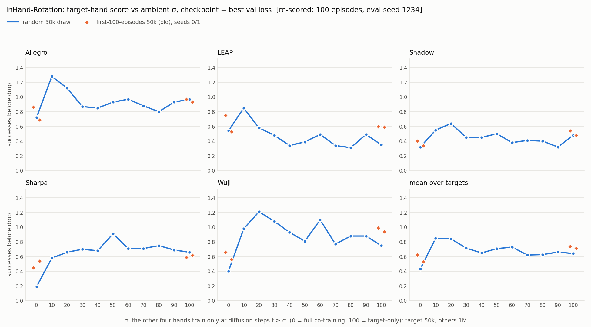
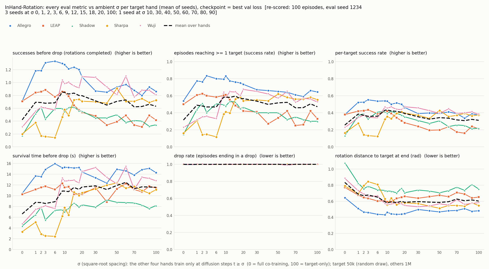

Raw values: [`plots/ambient_sigma_rotation_summary.csv`](plots/ambient_sigma_rotation_summary.csv).

**Takeaways.**
- **Pooled over hands, the best region is a plateau at σ 9–20** (0.80–0.85 successes vs 0.63 target-only and 0.42
  full co-training). It beats target-only in every training seed by +0.10 to +0.26. σ 1–6 gives only about +0.05.
- **Full co-training (σ 0) is below target-only in every seed** (−0.13 to −0.30), confirming E18.
- **The best σ depends on the hand.** Allegro, LEAP and Shadow already peak at σ 2–6. Sharpa and Wuji are hurt by low
  σ: Sharpa at σ 1–6 (0.14–0.38) is far below its target-only 0.73, and only matches it from σ 15. Wuji needs σ ≥ 9.
  So the pooled jump at σ 9 is the point where Sharpa and Wuji stop being hurt.
- **σ 15 is the most robust single setting:** it is at or above target-only for every hand (1.24, 0.65, 0.62, 0.73,
  0.95 vs 0.86, 0.42, 0.34, 0.73, 0.81), with a pooled 0.84. σ 9 has the highest pooled mean (0.85) but leaves Sharpa
  at 0.46, below its target-only 0.73.
- Compared with Bundle (peak at σ* = 2–3, Sharpa the exception), the per-hand peaks for Allegro, LEAP and Shadow are in
  the same low range, and Sharpa is again the exception. The pooled plateau sits higher here because of Sharpa and Wuji.
- Variance: 3 training seeds on **one** 50k data draw, and every number uses the same 100 eval start states per hand
  (seed 1234), which is also the set any σ would be chosen on. See the seed discussion in [A42](agent_log_book.md#a42).

**Links.** RUNS: `1052839` + idev rescore rows · Agent log: [A40](agent_log_book.md#a40), [A42](agent_log_book.md#a42) ·
CHANGES 70, 71, 73.

<a id="e18"></a>
### E18 — 2026-10-06 — Ambient σ sweep, rotation, random-draw 50k targets

**Question.** How does the target hand's performance change with the ambient gate σ, from full co-training
(σ=0) to target-only (σ=100) in steps of 10? Bundle reported a peak at low σ for a starved 50k rotation target.
Also, do the σ 0/100 conclusions of [E14](#e14) hold with properly random 50k target subsets
(see [E17](#e17))?  **Status.** done.

**Data.** Per target hand: `data/mjlab_hand_demos/padded_ta/InHand-Rotation_pad5_scarce<Hand>_K50kr.zarr`:
the target's 50k drawn **at random** from its 1M store (`subsets_50kr/`, draw seed 0), plus the other four
hands at 1M (~4.0M windows; [COLLECTIONS](COLLECTIONS.md)). Val store `val/rotation_val_20k.zarr`.

**Policy inputs/outputs.** Same as [E14](#e14): last 2 term-aligned observations (rotation width 91) → an
8-step action chunk at width 22 (only the hand's native prefix is executed); frozen family min/max
normalizer, x0 clamp 1.0.

**Protocol.**
- **Training:** noise-first ambient sampler; the target trains every timestep, the other four hands only
  t ≥ σ, σ ∈ {0, 10, …, 100}; 5 targets × 11 σ × seed 0 = 55 runs, ~784k steps (50–51 epochs), lr 1e-4,
  batch 256. Identical to [E14](#e14) except the dataset.
- **Reporting:** checkpoint `best_val` (user's choice), re-scored with `rescore_selected.py`, 100 envs ×
  1500 steps, eval seed 1234. One training seed.
- σ 0/100 comparison: [E14](#e14)'s runs on the old first-episodes subsets (`_K50k`), best_val, seeds 0/1.

**Results.** Successes before drop (rotations completed before the object falls):

| σ | 0 | 10 | 20 | 30 | 40 | 50 | 60 | 70 | 80 | 90 | 100 |
|---|---|---|---|---|---|---|---|---|---|---|---|
| Allegro | 0.72 | **1.28** | 1.12 | 0.87 | 0.85 | 0.93 | 0.97 | 0.88 | 0.80 | 0.93 | 0.97 |
| LEAP | 0.54 | **0.85** | 0.58 | 0.48 | 0.34 | 0.39 | 0.49 | 0.34 | 0.31 | 0.49 | 0.35 |
| Shadow | 0.32 | 0.55 | **0.64** | 0.45 | 0.45 | 0.50 | 0.38 | 0.41 | 0.40 | 0.32 | 0.48 |
| Sharpa | 0.19 | 0.58 | 0.66 | 0.70 | 0.68 | **0.91** | 0.71 | 0.71 | 0.75 | 0.69 | 0.66 |
| Wuji | 0.40 | 0.98 | **1.21** | 1.08 | 0.93 | 0.81 | 1.10 | 0.77 | 0.88 | 0.88 | 0.75 |
| **mean** | 0.43 | **0.85** | 0.84 | 0.72 | 0.65 | 0.71 | 0.73 | 0.62 | 0.63 | 0.66 | 0.64 |

Other metrics, mean over hands (σ 0 / 10 / 20 / 100):

| Metric | σ 0 | σ 10 | σ 20 | σ 100 |
|---|---|---|---|---|
| episodes reaching ≥ 1 target | 0.35 | 0.58 | 0.58 | 0.48 |
| per-target success rate | 0.27 | 0.43 | 0.40 | 0.32 |
| survival time before drop (s) | 7.1 | 10.9 | 12.1 | 11.4 |
| final rotation distance to target (rad, lower better) | 0.80 | 0.58 | 0.58 | 0.60 |
| drop rate | 1.00 | 1.00 | 1.00 | 1.00 |


Raw values (every metric, every run, plus the old-subset reference runs):
[`plots/ambient_sigma_rotation_summary.csv`](plots/ambient_sigma_rotation_summary.csv).

**Uncertainty.** One training seed. Episode-sampling SE per run is 0.05–0.12 (median 0.08). Mean over the 5
hands, 1 SE from episode sampling only: σ10 − σ100 = **+0.21 ± 0.05**, σ20 − σ100 = +0.20 ± 0.05,
σ0 − σ100 = −0.21 ± 0.05. Seed-to-seed variation is not included; per hand it was ~0.1–0.2 in [E14](#e14)'s
2-seed runs.

**σ 0/100 confirmation (old vs random subsets).** Mean over hands, best_val: old first-episodes subsets
(E14 runs, mean of seeds 0/1) σ0 0.58, σ100 0.73, gap −0.15; random draw (seed 0) σ0 0.43, σ100 0.64, gap −0.21.

**Takeaways.**
- **Keeping the other hands out of the lowest 10–20% of diffusion steps is the best setting:** +0.21 successes
  over target-only (0.85 vs 0.64, +33%) and about double full co-training (0.43). Four of five hands peak at
  σ 10–20. Sharpa peaks at σ 50 and is flat from 20 to 100. Every informative metric gives the same ordering.
- This reproduces, qualitatively, Bundle's noise-first result: a peak at low σ (σ* = 2–3 on Bundle's grid),
  with Sharpa again the exception. Our grid has step 10, so the true peak could be anywhere in 1–20.
- **Full co-training (σ0) is the worst setting for 4 of 5 hands.** LEAP is the exception (0.54 vs 0.35
  target-only). The other hands help the target only when kept out of the low-noise steps, where the fine,
  hand-specific action detail is denoised.
- Above σ≈30 the curve is flat at about the target-only level: data from other hands admitted only at high
  noise neither helps nor hurts.
- **[E14](#e14)'s rotation conclusion holds with random subsets:** full co-training does not beat target-only
  (−0.21 here, −0.15 with the old subsets). Both conditions score lower with the random draw (0.43/0.64 vs
  0.58/0.73). With one draw and one or two seeds this was not tested further.
- Drop rate is 1.00 everywhere: within 1500 steps nearly every episode ends in a drop, so it does not
  separate conditions.
- Next: more seeds (at least σ 0, 10, 20, 100), a finer grid in σ 1–20, the same sweep for grasp (Bundle saw
  gating hurt grasp monotonically), and fine-tuning from the σ 10–20 runs ([E15](#e15)).

**Links.** RUNS: `1049683` + idev rescore row · Agent log: [A39](agent_log_book.md#a39) · CHANGES 70, 71.

<a id="e17"></a>
### E17 — 2026-10-04 — Eval seed 0 replays the training starts: memorization check

**Question.** Target-only grasp runs scored 0.56–0.84 at their first in-training eval (epoch 5) and ~0.3–0.4
afterwards, and their re-scored `best_rollout` (= the epoch-5 checkpoint) was ~0.35. Why? And do the 50k
policies generalize, or memorize their demos?  **Status.** done.

**Data.** The 1M stores and the `subsets_50k/` 50k subsets ([COLLECTIONS](COLLECTIONS.md), 2026-10-05 section);
the policies of [E14](#e14) and [E15](#e15).

**Protocol.**
- **Collection seed:** not recorded in the store attrs, the HF mirror or the sbatch files. Determined from
  the data instead: episode-start obs of the 1M store vs `env.reset()` obs of fresh eval envs, by
  nearest-neighbour distance (exact match < 1e-4).
- **Memorization:** `last0` checkpoints (plus the epoch-5 `best_rollout` of Grasp-Allegro target-only),
  100 envs × 1500 steps, eval seed 0 (training starts) vs seed 1234 (new starts, the reporting seed;
  seed-1234 values from `final_eval.jsonl`). One run per cell (training seed 0).

**Results.**
- **The 1M demos were collected at env seed 0.** Seed 0 with 256 / 100 / 32 envs: 100% of reset states
  appear exactly in the 1M store; seeds 1234 and 7: 0%.
- **Each `subsets_50k/` store is the first ~100 episodes of its 1M store** (bitwise), so a seed-0 eval with
  ≤ 100 envs starts every env from a training start. In-training evals use the train seed (0) in a fresh env
  only at the first eval; later evals reuse the env without reseeding, which is why only the first eval was
  inflated.
- Same checkpoint (Grasp-Allegro target-only, epoch 5) at seeds 0 / 1234 / 7: **0.91 / 0.38 / 0.46**.

| Target | Condition | Seed 0 (training starts) | Seed 1234 (new starts) | Gap |
|---|---|---|---|---|
| Grasp-Allegro | target-only | 0.95 | 0.39 | **+0.56** |
| Grasp-Allegro | co-trained | 0.84 | 0.77 | +0.07 |
| Grasp-Allegro | co-trained + FT 1e-5 | 1.00 | 0.97 | +0.03 |
| Grasp-Sharpa | target-only | 0.92 | 0.32 | **+0.60** |
| Grasp-Sharpa | co-trained | 0.71 | 0.72 | −0.01 |
| Grasp-Sharpa | co-trained + FT 1e-5 | 0.98 | 0.97 | +0.01 |
| Rotation-Allegro | target-only | 1.14 | 1.09 | +0.05 |
| Rotation-Allegro | co-trained | 0.98 | 0.79 | +0.19 |
| Rotation-Allegro | co-trained + FT 1e-5 | 1.82 | 1.55 | +0.27 |
| Rotation-Wuji | target-only | 1.08 | 0.88 | +0.20 |
| Rotation-Wuji | co-trained | 0.60 | 0.52 | +0.08 |
| Rotation-Wuji | co-trained + FT 1e-5 | 1.47 | 1.80 | −0.33 |

Grasp: success rate. Rotation: successes before drop. Both evaluators score only each env's first episode
(`eval/grasp.py`, `eval/rotation.py`), so at seed 0 with 100 envs every scored episode starts from a training
start. (Corrected 2026-10-07: an earlier version said later auto-reset episodes dilute the seed-0 column; they
are not scored.)

**Takeaways.**
- **Target-only grasp policies memorize.** They succeed on 92–95% of their ~100 training starts and on 32–39%
  of new ones: 50k grasp demos cover only ~100 initial object poses.
- **Co-training removes the grasp gap**, and fine-tuning the co-trained policy on the same 100 episodes does
  not bring it back while reaching 0.97 on new starts. The [E14](#e14)/[E15](#e15) gains are generalization
  gains, measured on held-out starts.
- **Rotation shows no consistent memorization signal** (gaps −0.33 to +0.27, mixed signs, within noise for 100
  episodes).
- **Never score at env seed 0.** Reported numbers (seed 1234) are unaffected. In-training curves and
  `best_rollout` of runs on the old `subsets_50k/` are biased at the first eval. Re-collection is not needed:
  the seed is known and the reporting seed is disjoint. The rotation subsets were rebuilt as random draws
  ([E18](#e18), CHANGES 70), which cuts the seed-0 overlap to 1–2 of 32 in-training eval starts.

**Links.** Agent log: [A39](agent_log_book.md#a39) · CHANGES 70.

<a id="e16"></a>
### E16 — 2026-10-04 — Cross-embodiment generality of the generalists (co-trained vs fine-tuned)

**Question.** Each co-trained or fine-tuned policy was selected for one target hand. How well does it still
do on the other four hands of its family?  **Status.** done.

**Data / policy.** Same policies as [E14](#e14) (co-trained σ0) and [E15](#e15) (fine-tuned). Each policy is
evaluated on all 5 hands of its family through the term-aligned padded interface (`pad: true`).

**Protocol.** Checkpoint `last0`, 100 envs × 1500 steps, eval seed 1234, mean of 2 seeds.
`scripts/eval_cross_embodiment.py` → `<run>/cross_eval.jsonl`. The target (diagonal) cell is reused from
`final_eval.jsonl`. 300 scores in total.

**Results.** Mean over the 5 policies of each condition. "Own" is the diagonal; "others" is the mean
off-diagonal.

| | Grasp own | Grasp others | Rotation own | Rotation others |
|---|---|---|---|---|
| co-trained | 0.76 | 0.98 | 0.66 | 1.45 |
| FT lr 1e-4 | 0.84 | **0.00** | 1.29 | **0.00** |
| FT lr 1e-5 | 0.91 | 0.82 | 1.34 | 0.25 |

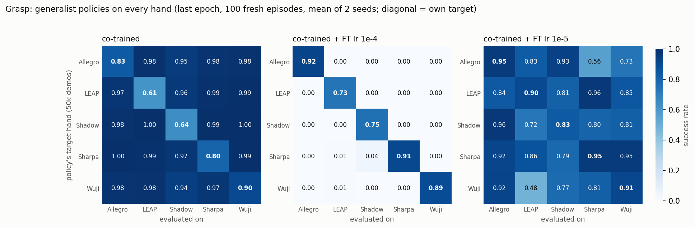
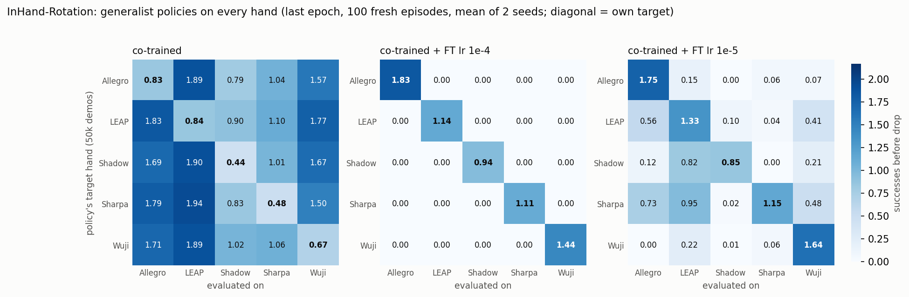

Rows are the policy's target hand, columns the hand it was evaluated on. Raw values:
[`plots/cross_embodiment_summary.csv`](plots/cross_embodiment_summary.csv).

**Takeaways.**
- A co-trained generalist is near-perfect on the four hands it saw at 1M (grasp 0.94–1.00) and weakest on its
  own 50k target.
- Fine-tuning at lr 1e-4 forgets catastrophically: almost every off-diagonal cell is exactly 0.00 in both
  families. lr 1e-5 keeps most of grasp (0.82) but loses most of rotation (0.25).
- For grasp, FT lr 1e-5 is both the best target policy and a reasonable generalist. For rotation, no single
  policy is good at both.

**Links.** RUNS: `1043385`, `1045839`, idev cross-eval row · Agent log: [A37](agent_log_book.md#a37) · CHANGES 68.

<a id="e15"></a>
### E15 — 2026-10-04 — Fine-tuning co-trained policies on the target hand

**Question.** Does a short target-only fine-tune of a co-trained policy beat both co-training and
target-only training on the scarce target?  **Status.** done.

**Data.** Same pooled store as the co-training run: `<Family>_pad5_scarce<Hand>_K50k` (target 50k + four hands at
1M; [COLLECTIONS](COLLECTIONS.md)). It is gated to the target only (tmin 0 for the target, 100 for the others,
noise-first), so in effect it trains on the 50k target data alone.

**Policy inputs/outputs.** Same as [E14](#e14). Initialized from the co-trained σ0 run's `policy_best_val.pt`,
whose normalizer comes with it (`--init-checkpoint`).

**Protocol.** 10 epochs (~156k steps) with a fresh optimizer, lr ∈ {1e-4, 1e-5}, 2 families × 5 targets × co-train
seeds {0,1} = 40 runs, eval + val every epoch. Re-scored with `rescore_selected.py` (best_rollout / best_val /
last0; 100 envs × 1500 steps; seed 1234).

**Results.** Target-hand score, mean over 5 targets × 2 seeds (best_rollout / best_val / last0):

| | Grasp (success) | Rotation (successes before drop) |
|---|---|---|
| target-only 50k (σ100) | 0.37 / 0.38 / 0.38 | 0.73 / 0.73 / 0.70 |
| co-trained (σ0) | 0.81 / 0.76 / 0.76 | 0.66 / 0.58 / 0.66 |
| co-trained + FT lr 1e-4 | 0.87 / 0.84 / 0.84 | **1.38** / **1.26** / 1.29 |
| co-trained + FT lr 1e-5 | **0.92** / **0.93** / **0.91** | 1.25 / 1.20 / **1.34** |

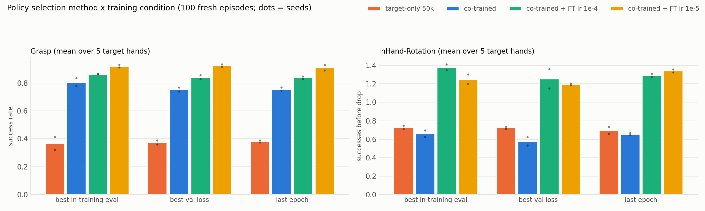
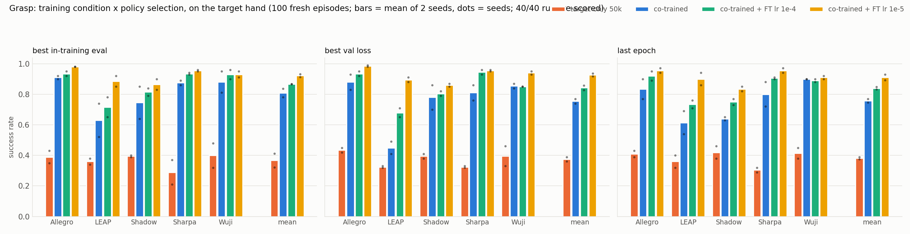
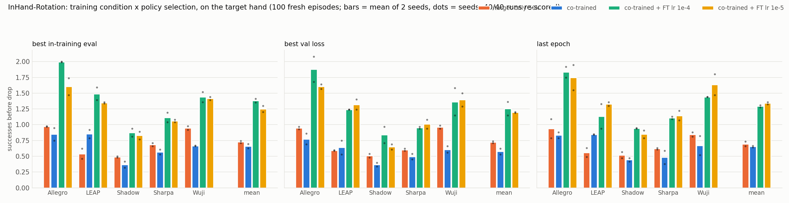

Raw values: [`plots/conditions_summary.csv`](plots/conditions_summary.csv).

**Takeaways.**
- Co-training then fine-tuning wins in both families. For rotation it roughly doubles both baselines,
  although co-training alone slightly hurt there.
- The checkpoint selection rule matters much less than the training condition.
- The cost is generality ([E16](#e16)).

**Links.** RUNS: `1045839` · Agent log: [A36](agent_log_book.md#a36), [A37](agent_log_book.md#a37) · CHANGES 67, 68.

<a id="e14"></a>
### E14 — 2026-10-03 — Co-training vs target-only on term-aligned stores (Bundle recipe)

**Question.** With 4M source transitions from four other hands plus 50k on the target hand, does co-training
beat 50k target-only data? Bundle reported grasp +0.46 and rotation −0.27.  **Status.** done.

**Data.** Per target hand and family: `data/mjlab_hand_demos/padded_ta/<Family>_pad5_scarce<Hand>_K50k.zarr`
(target 50k + other four at 1M, ~4.0M steps). Val store: `val/<family>_val_20k.zarr` (fresh expert rollouts,
~20k steps per hand).

**Policy inputs/outputs.** Diffusion policy (ConditionalUnet1D, down_dims 256/512/1024, cosine schedule with 100
train steps, DDIM with 16 inference steps).
- **Input:** the last 2 observations, each **term-aligned padded** to the family width: grasp 191, rotation 91.
  Each obs term has a block as wide as its widest version, the hand's values sit at the block start, and the
  padding is 0.
- **Output:** an 8-step action chunk at the padded width (grasp 28, rotation 22, front-packed). Only the hand's
  native prefix is executed.
- **Normalizer:** one frozen per-family min/max normalizer, `configs/norm_{grasp,rotation}_minmax.json`, with
  x0 clamp 1.0.

**Protocol.**
- **Training:** noise-first ambient sampler, σ ∈ {0 (co-train), 100 (target-only)}, seeds {0,1}, ~784k steps
  (49–51 epochs), lr 1e-4, batch 256, keep-last 3. In-training eval on the target only: 32 envs × 1500 steps,
  10 times per run.
- **Reporting:** `rescore_selected.py` with best_rollout / best_val / last0, 100 envs × 1500 steps, seed 1234.
- 40 runs.

**Results.** Mean over 5 targets of (co-train − target-only), 2 seeds:

| | best in-training eval | best val loss | last epoch |
|---|---|---|---|
| Grasp (success rate) | +0.441 | +0.380 | +0.376 |
| Rotation (successes before drop) | −0.066 | −0.147 | −0.041 |

- Grasp: co-training wins for all 5 targets under all 3 rules. Per target, last0 co-train vs target-only:
  Allegro 0.83/0.41, LEAP 0.61/0.36, Shadow 0.64/0.42, Sharpa 0.80/0.30, Wuji 0.90/0.42.
- Rotation: slightly negative for 4 of 5 targets (Wuji is worst, −0.18..−0.35). LEAP is positive (+0.05..+0.31).

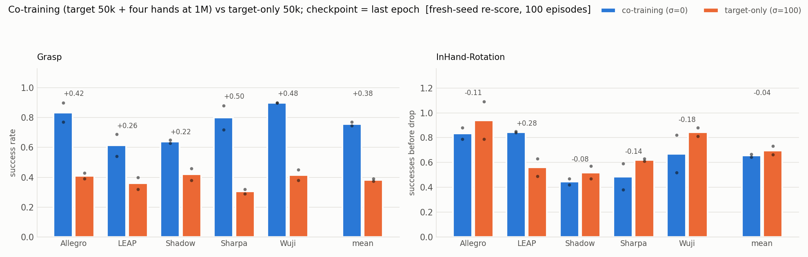
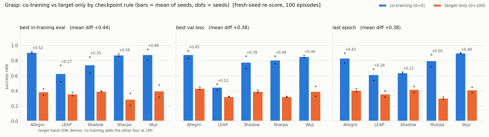
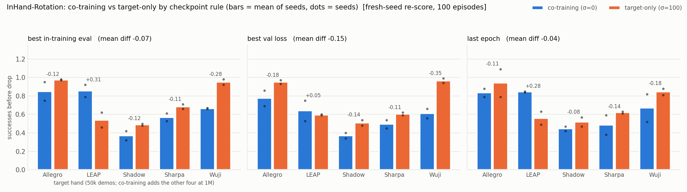

Raw values: [`plots/cotrain_vs_target_summary.csv`](plots/cotrain_vs_target_summary.csv).

**Takeaways.**
- This replicates Bundle's grasp gain (+0.46) and the sign of its rotation loss, which is smaller here.
- Compared with the tail-padded sweep ([E13](#e13)), where co-training collapsed to ~0.05 for Shadow, Sharpa and
  Wuji, term-aligned padding puts every hand on par with or above target-only.
- Caveat: our normalized action std (0.24/0.26) differs from Bundle's quoted 0.077 (CHANGES 63).

**Links.** RUNS: `1043385` + idev rescore row · Agent log: [A32](agent_log_book.md#a32)–[A36](agent_log_book.md#a36) ·
CHANGES 63, 65, 66.

> **Update 2026-10-06:** The 50k targets here are the first ~100 episodes of the 1M stores, and the first
> in-training eval (seed 0) starts from those training states, so `best_rollout` of the target-only grasp
> runs is the inflated epoch-5 checkpoint. The target-only grasp policies memorize (0.92–0.95 on training
> starts vs 0.32–0.39 on new ones), so the grasp gain is a generalization gain. See [E17](#e17). The rotation
> result was re-checked with random 50k draws in [E18](#e18): co-training is still below target-only (−0.21).

<a id="e13"></a>
### E13 — 2026-10-01 — Ambient rotation sweep on tail-padded stores (old layout)

**Question.** For a 50k rotation target co-trained with four 1M hands, how does target performance depend on
the ambient gate σ?  **Status.** done; provisional, because it was never re-scored with fresh seeds.
Superseded by the migration ([E14](#e14)).

**Data.** Per target: target 50k + other four 1M, pooled in memory, **tail-padded**: each hand's obs is
front-packed and zero-padded at the end. Columns therefore mean different things for different hands, except
for Allegro/LEAP.

**Policy inputs/outputs.** 2 obs (rotation family max 89, tail-padded) → 8-step action chunk (22, tail-padded).
Per-source min/max normalization (`--source-norm minmax`, CHANGES 58), data-first ambient sampler.

**Protocol.** σ ∈ {0,1,2,3,4,5,6,8,10,12,14,16,18,20,25,100} × 4 seeds × 5 targets = 320 runs, 50 epochs. In-training
evals: 32 envs, target only. Checkpoints reported are best_eval, best_val and latest.

**Results.** Target score rises with σ for every hand. At σ=0 (full co-training, last epoch): LEAP 0.58 (≈ its
σ=100 score of 0.52), Allegro 0.36, Shadow/Sharpa/Wuji ~0.05.

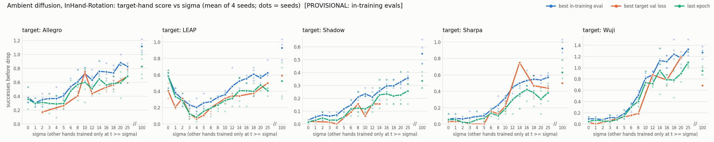
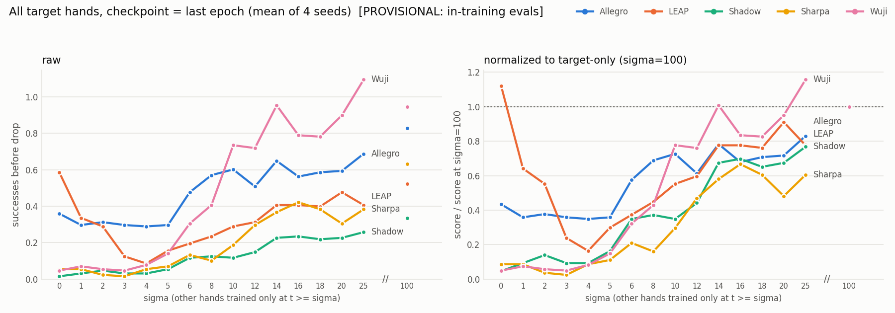

Raw values: [`plots/ambient_rot_summary.csv`](plots/ambient_rot_summary.csv).

**Takeaways.** Co-training works where the columns align (Allegro/LEAP have identical widths and term layout)
and fails where tail padding misaligns them. This is the evidence that motivated adopting Bundle's term-aligned
layout.

**Links.** RUNS: `1038730` · Agent log: [A25](agent_log_book.md#a25), [A31](agent_log_book.md#a31) · CHANGES 57, 62.

<a id="e12"></a>
### E12 — 2026-10-01 — Ambient minmax test: Allegro target, σ ∈ {0,10,25,100}

**Question.** Does the min/max padded ambient pipeline work end to end, and which way does σ move the target?
**Status.** done (1 seed).

**Data / policy.** Allegro rotation 50k + four 1M, tail-padded, per-source min/max, data-first. The same policy I/O
as [E13](#e13).

**Protocol.** 50 epochs, 1 run/node. Reporting eval with `eval_checkpoints.py`: 100 envs, env seed 1000.

**Results** (successes before drop; best_eval / best_val / latest):

| σ | Allegro (target, 50k) | LEAP (control, 1M, gated) |
|---|---|---|
| 0 | 0.31 / 0.19 / 0.38 | 1.84 / 1.78 / 1.76 |
| 10 | 0.41 / 0.48 / 0.42 | 0.00 / 0.00 / 0.00 |
| 25 | 0.56 / 0.65 / 0.66 | 0.00 / 0.00 / 0.00 |
| 100 | 0.81 / 1.11 / 0.90 | 0.00 / 0.00 / 0.00 |

**Takeaways.** The target improves monotonically with σ, so under this layout co-training hurts. LEAP is fully
functional when co-trained at every timestep, and exactly 0.00 when it is withheld from only the 10 lowest-noise
steps. This matches [E4](#e4)'s control.

**Links.** RUNS: `1036217`, `1038574` · Agent log: [A28](agent_log_book.md#a28), [A30](agent_log_book.md#a30).

<a id="e11"></a>
### E11 — 2026-09-30 — Why pooled/padded runs scored 0: normalization, not pooling

**Question.** The 09-28 scarce sweep scored ~0 on every hand, including the data-rich ones. Is pooling hands
the cause, or the padded code path?  **Status.** done.

**Data / policy.** Allegro rotation 1M and 50k, trained plain (native obs 69 → action 16, LinearNormalizer
min/max) and through the padded path (`--pool-sources`, Gaussian per-source normalizer or min/max).

**Results** (fresh eval: 100 envs, seed 1000, successes before drop; best_eval / best_val / latest):

| run | best_eval | best_val | latest |
|---|---|---|---|
| 1M plain | 1.74 | 2.10 | 1.91 |
| 1M padded **minmax** | 1.85 | 1.83 | 2.11 |
| 1M padded Gaussian | 0.00 at every eval (killed) | | |
| 50k plain | 0.87 | 0.66 | 0.92 |
| 5-hand pool co-train minmax (Allegro 50k + 4×1M) | 0.15 | 0.10 | 0.40 |

**Takeaways.**
- The padded path itself caused the zeros: the sampler's hard [-1,1] clamp, and the Gaussian normalizer's data
  scale. Padded min/max equals plain training within noise.
- Selection by in-training eval is optimistic: the pool's best_eval scored 0.44 during training and 0.15 on the
  fresh eval.

**Links.** RUNS: diag-rot-idev, diag-rot-idev2 · Agent log: [A26](agent_log_book.md#a26), [A27](agent_log_book.md#a27) · CHANGES 58.

<a id="e10"></a>
### E10 — 2026-09-28 — Vista job shape: throughput per node and across nodes

**Question.** What gets the most diffusion-BC runs through Vista: 1-node jobs that pack N runs each, or multi-node
jobs?  **Status.** done.

**Setup.** Grasp-Allegro 50k, production flags (compiled at the time), 4-node `gh-dev` idev.

**Results.**
- Per-node throughput is flat at ~0.37 run-epochs/s from 4 to 16 packed runs, with GPU utilization at 99%.
- A 4-node job ran 32/32 runs, with each node within 4% of a single node.
- Up to ~16 nodes, a job did not wait noticeably longer than a 1-node job (09-28 snapshot; see [A29](agent_log_book.md#a29)
  for a later, different snapshot).
- SU per run is unchanged. Storage on `$WORK` runs out long before scheduling limits do.

**Takeaways.** Use multi-node jobs (≤16 nodes). Packing only sets wall time, not cost. Measure the queue before
each large submission (AGENTS.md procedure). Full tables are in the
[archive](archive/ANALYSIS_2026-08-26_to_2026-09-28.md#2026-09-28--vista-job-shape-how-to-run-the-most-diffusion-bc-runs-at-once).

**Links.** Agent log: [A22](agent_log_book.md#a22) · CHANGES 54.

<a id="e9"></a>
### E9 — 2026-09-27 — Single-hand specialist baselines (old cluster)

**Question.** What does one hand's own data give at 50k and 1M?  **Status.** partial: rotation evals were never
tabulated.

**Data / policy.** Native per-hand obs → 8-step native action chunk, LinearNormalizer min/max, ~780k gradient
steps (200 epochs at 1M, 4000 at 50k), 2 seeds, val fraction 0.1.

**Results.**
- Grasp specialists at 1M: all 5 hands × 2 seeds ≈ 1.0 success.
- Grasp at 50k: 4 of 5 hands available; Allegro is missing, and two seed-1 runs were cut short.
- Pooled AllHands, tail-padded, Gaussian: ~0 everywhere (explained by [E11](#e11)).
- Rotation specialists (`97798`): Allegro, LEAP, Shadow and Sharpa × {50k,1M} × 2 seeds completed with all three
  checkpoints. Wuji seed 1 was still running at the last check (2026-09-27), and its outcome was not recorded.
  None of the scores were tabulated. The outputs are on the old cluster (`outputs/diffusion/specialist/`).

**Links.** RUNS: `89262`, `90599`, `97798` · Agent log: [A14](agent_log_book.md#a14)–[A19](agent_log_book.md#a19).

<a id="e8"></a>
### E8 — 2026-09-13 — More networks per GPU: vmap over seeds, bf16, torch.compile (A40)

**Results.**

| batch | n_seeds 2 | 4 | 8 | 16 |
|---|---|---|---|---|
| 16 | 1.16× | 1.54× | 1.76× | 1.84× |
| 256 | 0.87× | 0.95× | 0.97× | 1.00× |

- vmap speed-up over sequential seeds is in the table above. bf16 autocast is *slower* (29.7 → 32.3 ms/step).
- `torch.compile` speeds up `compute_loss` 1.34× and `predict_action` 2.02×.

**Takeaways.** At batch 256 one network already saturates an A40. Only compile is worth using. It was later wired
in (CHANGES 53) and then removed for numerics parity (CHANGES 63).

**Links.** Agent log: [A16](agent_log_book.md#a16) · CHANGES 46.

<a id="e7"></a>
### E7 — 2026-09-02 — Rotation BC at 400k (LEAP, Allegro)

**Data / policy.** `InHand-Rotation-{LEAP,Allegro}_expert_400k.zarr`; native obs 69 × 2 → action chunk 8 × 16;
min/max normalizer; 500 epochs.

**Results.** Final eval, 32 rollouts: LEAP **2.31** successes before drop, Allegro **1.62**. Drop rate is 100% for
both, so policies keep rotating until the object falls.

**Links.** RUNS: `80853`, `80854` · Agent log: [A6](agent_log_book.md#a6).

<a id="e6"></a>
### E6 — 2026-08-31 — Learned state equivalence (shared invariant encoder)

**Question.** Can Allegro/LEAP share an object/goal encoder with per-hand heads?
**Results.**
- Matched task states exist: the cross-hand/self nearest-neighbour ratio is 0.88 for grasp and 1.75 for rotation.
- The object/goal subspace is still hand-separable (rotation 0.964).
- At a matched task state, the other hand's action adds nothing (R² 0.065 vs 0.784 for rotation).
- With a gradient-reversal adversary at λ up to 100, a fresh probe still identifies the hand at ≥0.977, while
  task R² drops.

**Takeaways.** Closed. Always score invariance with a fresh probe, not the adversary's own accuracy. Sequential
transfer (pretrain → fine-tune) was the one idea left untested, and [E15](#e15) tests a version of it.
**Links.** CHANGES 37–38 · [archive](archive/ANALYSIS_2026-08-26_to_2026-09-28.md).

<a id="e5"></a>
### E5 — 2026-08-27 — The observation identifies the embodiment at every timestep

**Results.**
- A linear probe on one observation separates Allegro from LEAP at accuracy 1.000.
- The observation is never noised, so identity is recoverable at t=99.
- After per-hand centring or standardization, the linear AUC drops to 0.50, but an MLP still scores 0.999.
- One dimension is enough: grasp `hand_dof_pos[9]` gives AUC 0.9998.

**Takeaways.** Masking or invariance schemes that rely on high-noise unidentifiability cannot work here. This
also explains why one-hot labels were redundant ([E2](#e2)). Never conclude "removable" from a linear probe alone.
**Links.** CHANGES 30–31 · [archive](archive/ANALYSIS_2026-08-26_to_2026-09-28.md).

<a id="e4"></a>
### E4 — 2026-08-27 — Ambient diffusion sweep, Allegro target + LEAP source (data-first)

**Data / policy.** Allegro N ∈ {10k,50k,100k,400k} + LEAP 400k, matching widths (grasp 115/22, rotation 69/16),
one-hot. Ambient gate σ* ∈ {0,50,75,90,100}, 2 seeds, 100-rollout evals.

**Results.**
- Grasp: the interior is a valley; at 50k it falls 0.98 → 0.46.
- Rotation: null (+0.067 / +0.054 against an sd of 0.196).
- LEAP, the gated control: exactly 0.000 at σ* ≥ 75 (grasp) and ≥ 50 (rotation).

> **Update 2026-09-01:** this sweep used the tuple-first (data-first) sampling order, which starves low-noise
> training (A5). Bundle retracted its "falsified" reading for the same reason. The control result (a hand
> trained only at coarse noise is non-functional) was reproduced in [E12](#e12) with the fixed code.

**Links.** CHANGES 24–28, 32, 36 · Agent log: [A3](agent_log_book.md#a3), [A5](agent_log_book.md#a5).

<a id="e3"></a>
### E3 — 2026-08-27 — Ambient premise check: when do noised action distributions converge?

**Results.**
- Raw (uncentred) W1 between noised Allegro and LEAP actions decays almost linearly, from 1.13 at t=0 to ~0.40 at
  t=75. It reaches the near-identical band only at t≈95.
- Mean-centred W1 collapses by t≈25.

**Takeaways.** Moved the planned σ* grid from {25,50,75} to {50,75,90}.
**Links.** `scripts/measure_ambient_threshold.py` · [archive](archive/ANALYSIS_2026-08-26_to_2026-09-28.md).

<a id="e2"></a>
### E2 — 2026-08-26 — Mixed-embodiment one-hot grid (Allegro + LEAP)

**Data / policy.** Own budget × partner budget grid, one-hot embodiment label appended to the native obs (115 / 69).
40 cells, 1 seed, 32-episode evals.

**Results.**
- The mean effect of adding the partner is about 0 (grasp −0.009, rotation −0.017).
- Own data does 8–20× more work than partner data.
- One plausible real effect: partner data helps Allegro rotation at 100k own data (+0.34 → +0.63, monotone in
  partner size) and hurts it at 400k.

**Takeaways.** The grid was underpowered (the 32-episode eval floor is 0.053), and grasp saturates. Compute the
noise floor before sizing a grid.
**Links.** CHANGES 13–22 · [archive](archive/ANALYSIS_2026-08-26_to_2026-09-28.md).

<a id="e1"></a>
### E1 — 2026-08-26 — Observation/action spaces across embodiments

**Results.**

| | Allegro | LEAP | Shadow | Sharpa | Wuji |
|---|---|---|---|---|---|
| Grasp obs/act | 115/22 | 115/22 | 189/26 | 136/28 | 130/26 |
| Rotation obs/act | 69/16 | 69/16 | 89/20 | 87/22 | 81/20 |

- Only Allegro and LEAP match in widths and term layout. Their joint order differs, though (corrected
  2026-09-30, `outputs/analysis/spaces_reference.md`).
- Actions are stored pre-clip, so |a| reaches ~15.
- Allegro vs LEAP differ mostly by a rigid offset (per-dimension W1 1.2 → 0.34 after centring). [E5](#e5) shows
  that this does not make them interchangeable.

**Links.** CHANGES 19–21, 59 · [archive](archive/ANALYSIS_2026-08-26_to_2026-09-28.md).
